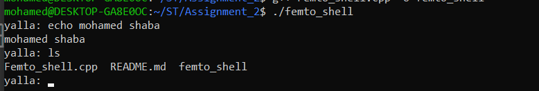
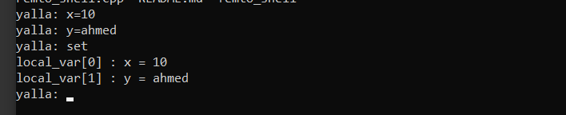
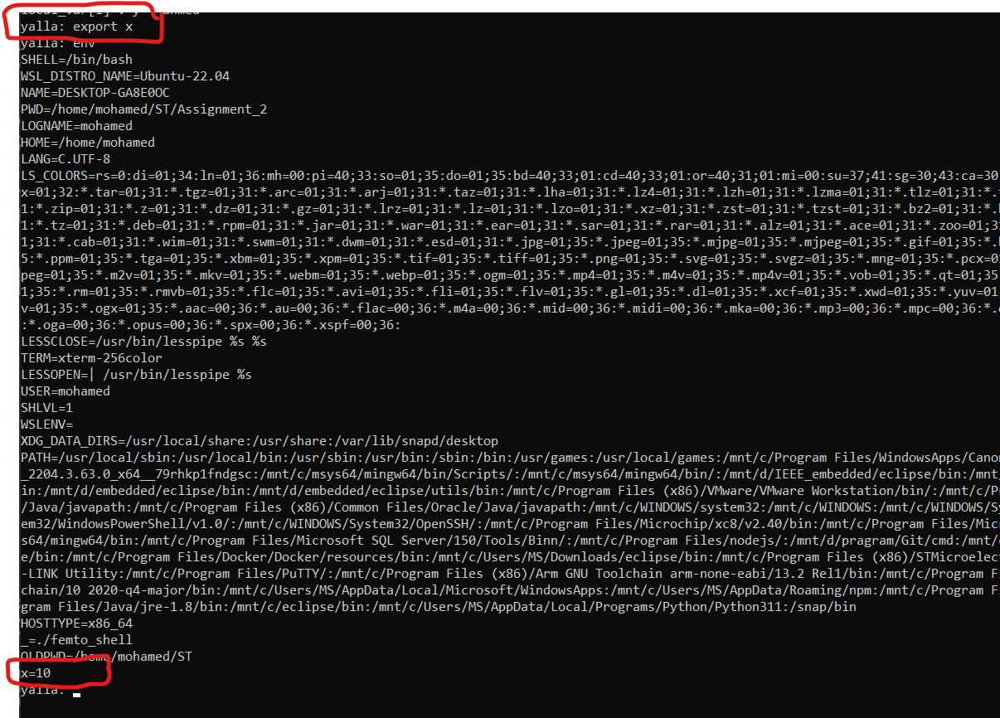

# Femto shell

## features
-  Executing external commands
-  add varible to local var like(x=10)
- show all local var using **set** command
- add local var to **env** using **export** command


## How to used

**run femto-shell**
```
./femto_shell
```
**used any external cmd**


**add a var to local_var**


**add local var to env**
